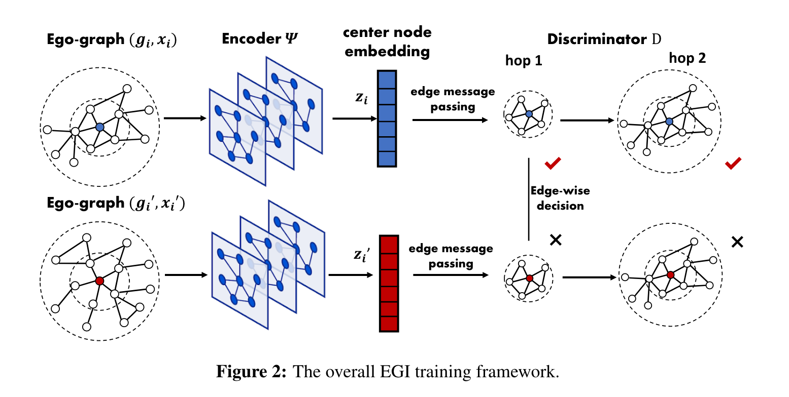

---
jupyter:
  jupytext:
    formats: ipynb,md
    text_representation:
      extension: .md
      format_name: markdown
      format_version: '1.3'
      jupytext_version: 1.11.5
  kernelspec:
    display_name: Python 3 (ipykernel)
    language: python
    name: python3
---

# Introduction 

The aim of this notebook is to give a high level overview of the EGI framework code.

This notebook primarily runs through the run_airport.py experiment, annotating and refactoring code.




## Some setup 


Does our GPU work?

This works on any CUDA 11 compatible GPU, but has been written and tested on a 3060 only

```python
!nvcc --version
```

```python
# Import egi code here
# TODO: make this a pip library
import sys
sys.path.append("../../egi")
```

```python
# Imports
import argparse, time
import numpy as np
import networkx as nx
import torch
import torch.nn as nn
import torch.nn.functional as F
import dgl
from dgl import DGLGraphStale as DGLGraph
from dgl.data import register_data_args, load_data
from models.dgi import DGI, MultiClassifier
from models.subgi import SubGI
#from models.vgae import VGAE
from IPython import embed
import scipy.sparse as sp
from collections import defaultdict
from torch.autograd import Variable
from tqdm.notebook import tqdm
import pickle
from collections import defaultdict
from sklearn.manifold import SpectralEmbedding
from types import SimpleNamespace
import plotly.graph_objects as go

from overview_code import *

```

```python
"""
Plot and show a given airport graph. 

Colours the graph according to airport popularity.

G : The airport graph
labels: a map of node ids to labels

Returns: None
"""
def plot_airport_graph(G,labels):
    # adapted from https://plotly.com/python/network-graphs/
    
    # give the nodes positions
    positions = nx.spring_layout(G)
    
    edge_x = []
    edge_y = []
    for edge in G.edges():
        x0, y0 = positions[edge[0]]
        x1, y1 = positions[edge[1]]
        edge_x.append(x0)
        edge_x.append(x1)
        edge_x.append(None)
        edge_y.append(y0)
        edge_y.append(y1)
        edge_y.append(None)

    edge_trace = go.Scatter(
        x=edge_x, y=edge_y,
        line=dict(width=0.5, color='#888'),
        hoverinfo='none',
        mode='lines')

    node_x = []
    node_y = []
    for node in G.nodes():
        x, y = positions[node]
        node_x.append(x)
        node_y.append(y)

    node_trace = go.Scatter(
        x=node_x, y=node_y,
        mode='markers',
        hoverinfo='text',
        marker=dict(
            showscale=True,
            # colorscale options
            #'Greys' | 'YlGnBu' | 'Greens' | 'YlOrRd' | 'Bluered' | 'RdBu' |
            #'Reds' | 'Blues' | 'Picnic' | 'Rainbow' | 'Portland' | 'Jet' |
            #'Hot' | 'Blackbody' | 'Earth' | 'Electric' | 'Viridis' |
            colorscale='YlGnBu',
            reversescale=True,
            color=[],
            size=10,
            colorbar=dict(
                thickness=15,
                title='Airport popularity',
                xanchor='left',
                titleside='right'
            ),
            line_width=2))
    
    node_popularity = []
    for node in G.nodes():
        node_popularity.append(labels.get(node,0))
        
    node_trace.marker.color = node_popularity
    
    fig = go.Figure(data=[edge_trace, node_trace],
             layout=go.Layout(
                showlegend=False,
                hovermode='closest',
                margin=dict(b=20,l=5,r=5,t=40),
                annotations=[ dict(
                    text="The airports network",
                    showarrow=False,
                    xref="paper", yref="paper",
                    x=0.005, y=-0.002 ) ],
                xaxis=dict(showgrid=False, zeroline=False, showticklabels=False),
                yaxis=dict(showgrid=False, zeroline=False, showticklabels=False))
                )
    fig.show()
```

# 1. The Airport Dataset

In this example, we are using the provided airport data set. This links airports that fly to eachother with edges, as well as providing labels on the relative popularities of certain airports.

For our training and test data, we will use the airports of the USA.


**First, we must set some options for the model:**

```python
opts = SimpleNamespace(
    edge_path = "../../egi/data/usa-airports.edgelist",
    label_path="../../egi/data/labels-usa-airports.txt",
    data_src="",
    data_id="",
    gpu=0,
    model_id=2,
    dropout=0.0,
    dgi_lr=0.001,
    classifier_lr=1e-2,
    n_dgi_epochs=100,
    n_classifier_epochs=100,
    n_hidden=32,
    n_layers=1,
    weight_decay=0.,
    patience=20,
    model=True,
    self_loop=True,
    model_type=2,
    graph_type="DD"

)
```

* * * 


The data:

```python
!head -n 5 "../../egi/data/usa-airports.edgelist"
```

```python
!head -n 5 "../../egi/data/labels-usa-airports.txt"
```

**Now, we can read in the dataset as a NetworkX graph**

```python
"""
Read in a graph from a given edge list and node label list.


edge_list: A file containing edges. This must be in the form:
    <int> <int>
    <int> <int>

    where each line contains the integer IDs of the nodes on each edge.
    
    
edge_list: A file containing node labels. This must be in the form:
    <int> <string>
    <int> <string>

    where each line contains the integer ID of a node, followed by its label.
    
    
    
Returns: a networkx graph, and a dictionary of labels.

"""
def read_graph(edge_path,label_path):
    g = nx.Graph()
    
    with open(edge_path) as IN:
        for line in IN:
            tmp = line.strip().split()
            g.add_edge(int(tmp[0]), int(tmp[1]))
    labels = dict()
    with open(label_path) as IN:
        IN.readline()
        for line in IN:
            tmp = line.strip().split(' ')
            labels[int(tmp[0])] = int(tmp[1])
    return g, labels
```

```python
g,labels = read_graph(opts.edge_path,opts.label_path)
```

```python
plot_airport_graph(g,labels)
```

**Our aim is to direct-transfer the node labels from this graph onto another with a different topology.**

For our validation data, we use the Brazil airport data.

```python
validation_g,validation_labels = read_graph("../../egi/data/brazil-airports.edgelist",
                                            "../../egi/data/brazil-airports.edgelist")
plot_airport_graph(validation_g,{})
```

# 2. Data Preprocessing


**Remove self-loops from the graph**

```python
g.remove_edges_from(nx.selfloop_edges(g))
```

## 2.1 Conversion to DGL


For the rest of the model, we need the graph as  a `DGL` graph, and the labels as a `Tensor`.

```python
"""
Convert the graph from a NetworkX graph into a DGL graph.

graph: a networkx graph
labels: a dictionary mapping node IDs to labels


Returns: a tuple of:
    graph: the graph, as a DGL graph.
    labels: the labels, as a LongTensor .
    
"""
def constructDGL(graph, labels):
    node_mapping = defaultdict(int)
    
    relabels = []
    for node in sorted(list(graph.nodes())):
        node_mapping[node] = len(node_mapping)
        relabels.append(labels[node])

    assert len(node_mapping) == len(labels)
    
    new_g = DGLGraph()
    new_g.add_nodes(len(node_mapping))
    
    for i in range(len(node_mapping)):
        new_g.add_edge(i, i)
    for edge in graph.edges():
        new_g.add_edge(node_mapping[edge[0]], node_mapping[edge[1]])
        new_g.add_edge(node_mapping[edge[1]], node_mapping[edge[0]])
        
    # convert labels to tensor
    relabels = torch.LongTensor(relabels)
    return new_g, relabels


```

```python
g, labels = constructDGL(g, labels)
```

## 2.2 Creation of training and test sets

```python
"""
Partition the labels into training and test sets.

labels: a LongTensor of labels to partition into training and test sets.

valid_mask: ???

train_ratio: the proportion of data to use as training data.
    Default: 0.8
    
Returns: a tuple containing a training mask and a test mask. These are both BoolTensors.
"""
def createTraining(labels, valid_mask = None, train_ratio=0.8):
 
    train_mask = torch.zeros(labels.shape, dtype=torch.bool)
    test_mask = torch.ones(labels.shape, dtype=torch.bool)
    
    num_train = int(labels.shape[0] * train_ratio)
    all_node_index = list(range(labels.shape[0]))
    np.random.shuffle(all_node_index)
    #for i in range(len(idx) * train_ratio):
    # embed()
    train_mask[all_node_index[:num_train]] = 1
    test_mask[all_node_index[:num_train]] = 0
    if valid_mask is not None:
        train_mask *= valid_mask
        test_mask *= valid_mask
        
    return torch.BoolTensor(train_mask), torch.BoolTensor(test_mask)

```

```python
train_mask, test_mask = createTraining(labels)
```

# 3. Embedder


## 3.1 Initialisation


**Initialise the parameters of the embedder model**

```python
emb_degree = nn.Parameter(torch.FloatTensor(np.random.normal(0, 1, [100, opts.n_hidden])), requires_grad=False)
```

**The features of our data are the node degrees.**

```python
"""
For a given graph, create a tensor of nodes to node degrees.

graph: A DGL graph
opts: The model options

Return: a Tensor with the shape (number_of_nodes,max_degree). 

    For a node n with degree d, this tensor contains a 1 
    in position feature[n][d], and a 0 otherwise.
....
"""
def degree_bucketing(graph, opts, degree_emb=None, max_degree = 10):
    
    max_degree = opts.n_hidden
    features = torch.zeros([graph.number_of_nodes(), max_degree])

    for i in range(graph.number_of_nodes()):
        try:
            features[i][min(graph.in_degree(i), max_degree-1)] = 1
        except:
            features[i][0] = 1
    return features

```

```python
features = degree_bucketing(g, opts, degree_emb)
in_feats = features.shape[1]

in_feats
```

```python
n_classes = labels.max().item() + 1
n_classes 
```

```python
n_edges = g.number_of_edges()
n_edges
```

**Are we running on a GPU? If so, enable CUDA for tensors.**

```python
if opts.gpu < 0:
          cuda = False
else:
  cuda = True
  torch.cuda.set_device(opts.gpu)
  features = features.cuda()
  labels = labels.cuda()

```

EGI is a method that can work on many different GNNs. Here, we support DGI and SubGI. VGAE is currently broken. 

```python
if opts.model_type == 0:
  dgi = DGI(g,
          in_feats,
          opts.n_hidden,
          opts.n_layers,
          nn.PReLU(opts.n_hidden),
          opts.dropout)


#   if args.model_type == 1:
#       dgi = VGAE(g,
#           in_feats,
#           args.n_hidden,
#           args.n_hidden,
#           args.dropout)


#       dgi.prepare()
#       dgi.adj_train = sp.csr_matrix(output_adj(g))


elif opts.model_type == 2:
  dgi = SubGI(g,
          in_feats,
          opts.n_hidden,
          opts.n_layers,
          nn.PReLU(opts.n_hidden),
          opts.dropout,
          opts.model_id)


if cuda:
    dgi.cuda()
```

```python
dgi_optimizer = torch.optim.Adam(dgi.parameters(),
                              lr=opts.dgi_lr,
                              weight_decay=opts.weight_decay)

```

```python
cnt_wait = 0
best = 1e9
best_t = 0
dur = []
g.ndata['features'] = features.to(torch.device('cpu')) # hacky hack to make DGI happy 
```

## 3.2 Training the Embedder


```python
"""
A single training epoch of the embedder.
"""
def embedder_training_epoch(dgi,dgi_optimizer,cnt_wait,best,best_t,dur,g):
    
    
    train_sampler = dgl.contrib.sampling.NeighborSampler(g, 256, 5,
                                                   neighbor_type='in', num_workers=1,
                                                   num_hops=args.n_layers + 1, shuffle=True)

    dgi.train()

    if epoch >= 3:
      t0 = time.time()

    loss = 0.0

    # VGAE mode
    #if args.model_type == 1:
    #   dgi.optimizer = dgi_optimizer
    #   dgi.train_sampler = train_sampler
    #   dgi.features = features
    #   loss = dgi.train_model()

    
    # EGI mode
    if args.model_type == 2:
        for nf in train_sampler:
          dgi_optimizer.zero_grad()
          l = dgi(features, nf)
          l.backward()
          loss += l
          dgi_optimizer.step()

    # DGI mode
    elif args.model_type == 0:
      dgi_optimizer.zero_grad()
      loss = dgi(features)
      loss.backward    
      dgi_optimizer.step()
        
    if loss < best:
        best = loss
        best_t = epoch
        cnt_wait = 0
        torch.save(dgi.state_dict(), 'best_classification_{}.pkl'.format(args.model_type))
    else:
      cnt_wait += 1

    if cnt_wait == args.patience:
      print('Early stopping!')
      return

    if epoch >= 3:
      dur.append(time.time() - t0)

    
    classifier = create_classifier()
    train_classifier(classifier)


```

```python
for epoch in range(args.n_dgi_epochs):


  # create classifier model
  classifier = MultiClassifier(args.n_hidden, n_classes)
  if cuda:
      classifier.cuda()

  classifier_optimizer = torch.optim.Adam(classifier.parameters(),
                                          lr=args.classifier_lr,
                                          weight_decay=args.weight_decay)


  # flags used for transfer learning
  if args.data_src != args.data_id:
      pass
  else:
      dgi.load_state_dict(torch.load('best_classification_{}.pkl'.format(args.model_type)))

  with torch.no_grad():
      if args.model_type == 1:
          _, embeds, _ = dgi.forward(features)
      elif args.model_type == 2:
          embeds = dgi.encoder(features, corrupt=False)
      elif args.model_type == 0:
          embeds = dgi.encoder(features)
      else:
          dgi.eval()
          test_sampler = dgl.contrib.sampling.NeighborSampler(g, g.number_of_nodes(), -1,
                                                                  neighbor_type='in', num_workers=1,
                                                                  add_self_loop=False,
                                                                  num_hops=args.n_layers + 1, shuffle=False)
          for nf in test_sampler:
              nf.copy_from_parent()
              embeds = dgi.encoder(nf, False)
              print("test flow")

  embeds = embeds.detach()

  dur = []
  for epoch in range(args.n_classifier_epochs):
      classifier.train()
      if epoch >= 3:
          t0 = time.time()

      classifier_optimizer.zero_grad()
      preds = classifier(embeds)
      loss = F.nll_loss(preds[train_mask], labels[train_mask])
      # embed()
      loss.backward()
      classifier_optimizer.step()

      if epoch >= 3:
          dur.append(time.time() - t0)
      #acc = evaluate(classifier, embeds, labels, train_mask)
      #acc = evaluate(classifier, embeds, labels, val_mask)
      #print("Epoch {:05d} | Time(s) {:.4f} | Loss {:.4f} | Accuracy {:.4f} | "
      #      "ETputs(KTEPS) {:.2f}".format(epoch, np.mean(dur), loss.item(),
      #                                    acc, n_edges / np.mean(dur) / 1000))

  # print()
  acc = evaluate(classifier, embeds, labels, test_mask)

  return acc;

```

```python
def evaluate(model, features, labels, mask):
    model.eval()
    with torch.no_grad():
        logits = model(features)
        logits = logits[mask]
        labels = labels[mask]
        _, indices = torch.max(logits, dim=1)
        correct = torch.sum(indices == labels)
        return correct.item() * 1.0 / len(labels)

```


```python
"""
Run the model.

- args: A namespace containing the experiment options.

Returns: the success-rate of the model.
"""

def run_model(args):
    


```

# Generation of ego-graphs

> Sample M ego-graphs {(g1, x1), ..., (gM , xM )} from empirical distribution P without replacement

```python
# Run the model multiple times, and print the average and standard deviation of the results
test_results = []

for runs in tqdm(range(10)):
  test_results.append(run_model(opts));

print("Test Accuracy {:.4f}, std {:.4f}".format(np.mean(test_results), np.std(test_results)))
```

# The encoder


# Center Node embedding


# Discriminator 

```python

```

```python

```
